# memory-test 学习知识图谱

> 单一事实源：`./graph.json`。本文件（Mermaid 图谱 + 节点说明表）严格对齐 JSON；新增节点时请同步两边。

## 对应章节
- 锚点脚本：`src/history-test.mjs`（两轮多轮对话：手动管理 SystemMessage + HumanMessage + AIMessage 历史，存于内存数组）+ `src/history-test2.mjs`（同上但用 FileSystemChatMessageHistory 持久化到 JSON 文件，支持 sessionId 多会话）
- 范围：LangChain ChatMessageHistory 核心概念 + 消息类型 + 对话轮次处理 + 上下文传递机制 + 持久化 + 多会话 + 设计模式（手动 vs RunnableWithMessageHistory 自动）
- 节点总数：41（step: 13 / concept: 22 / param: 6）
- 边总数：64

## 流程图（两轮对话全景）

```mermaid
flowchart TD
    %% ============ 概念层 ============
    subgraph CONCEPT["概念层 — 消息 & 历史"]
        baseMsg["concept.base_message<br/>BaseMessage 基类"]
        human["concept.human_message<br/>HumanMessage<br/><i>type='human'</i>"]
        ai["concept.ai_message<br/>AIMessage<br/><i>type='ai'</i>"]
        system["concept.system_message<br/>SystemMessage<br/><i>type='system'</i>"]
        chatHistory["concept.chat_history<br/>BaseChatMessageHistory 接口"]
        inMem["concept.in_memory_history<br/>InMemoryChatMessageHistory"]
        methods["concept.api_methods<br/>addMessage / getMessages / clear"]
        lifecycle["concept.lifecycle<br/>进程级生命周期"]
    end

    %% ============ 模型 & 调用 ============
    subgraph MODEL["模型 & 调用"]
        llm["concept.llm<br/>ChatOpenAI 客户端"]
        invoke["concept.model_invoke<br/>model.invoke"]
    end

    %% ============ 对话模式 ============
    subgraph PATTERN["对话模式"]
        turn["concept.turn<br/>对话轮次 Turn"]
        ctxPass["concept.context_passing<br/>上下文传递"]
        sysStrat["concept.system_message_strategy<br/>SystemMessage 拼接策略"]
        winBuf["concept.window_buffer<br/>窗口缓冲"]
        tokenG["concept.token_growth<br/>token 线性增长"]
    end

    %% ============ 设计模式 ============
    subgraph DESIGN["设计模式"]
        manual["concept.design_pattern_manual<br/>手动管理 5 步法<br/><i>src/history-test.mjs</i>"]
        auto["concept.design_pattern_auto<br/>RunnableWithMessageHistory<br/>自动管理"]
    end

    %% ============ 对比 ============
    subgraph COMPARE["对比"]
        persistent["concept.comparison_persistent<br/>持久化实现"]
    end

    %% ============ 初始化 ============
    subgraph INIT["初始化"]
        sInitModel["step.init_model<br/>初始化模型"]
        sInitHist["step.init_history<br/>创建 history 实例"]
        sBuildSys["step.build_system<br/>构造 SystemMessage"]
    end

    %% ============ 一轮对话五步法 ============
    subgraph TURN_STEPS["一轮对话（5 步）"]
        sAddHuman["step.add_human<br/>addMessage HumanMessage"]
        sCompose["step.compose_messages<br/>拼装 messages"]
        sInvoke["step.invoke_model<br/>model.invoke"]
        sAddAI["step.add_ai<br/>addMessage AIMessage"]
        sPrintRound["step.print_round<br/>打印本轮对话"]
    end

    %% ============ 验证 ============
    subgraph VERIFY["验证"]
        sPrintHist["step.print_history<br/>打印完整历史"]
    end

    %% ============ 持久化（history-test2.mjs 独有） ============
    subgraph PERSISTENT["持久化（history-test2.mjs）"]
        fsHist["concept.filesystem_history<br/>FileSystemChatMessageHistory"]
        sessionId["concept.session_id<br/>sessionId 会话标识"]
        persistence["concept.persistence<br/>持久化 Persistence"]
        multiSession["concept.multi_session<br/>多会话 Multi-Session"]
        sResolvePath["step.resolve_filepath<br/>解析文件路径"]
        sBindSession["step.bind_session<br/>绑定 sessionId"]
        sOpenPersHist["step.open_history_persistent<br/>创建持久化 history"]
        sPrintPersist["step.print_persist_notice<br/>打印持久化提示"]
        pFilePath["param.filepath<br/>FILE_PATH"]
        pSessionId["param.session_id_const<br/>SESSION_ID"]
    end

    %% ============ 参数 ============
    subgraph PARAMS["参数（来自 .env）"]
        pModel["param.model_name<br/>MODEL_NAME"]
        pKey["param.openai_api_key<br/>OPENAI_API_KEY"]
        pUrl["param.openai_base_url<br/>OPENAI_BASE_URL"]
        pTemp["param.temperature<br/>temperature: 0"]
    end

    %% ============ 边：概念依赖 ============
    chatHistory --> inMem
    inMem --> baseMsg
    baseMsg --> human
    baseMsg --> ai
    baseMsg --> system

    %% ============ 边：步骤 -> 概念 ============
    sInitHist --> inMem
    sInitModel --> llm
    sBuildSys --> system
    sAddHuman --> human
    sAddAI --> ai
    sCompose --> ctxPass
    sInvoke --> invoke

    %% ============ 边：五步法顺序 ============
    sInitHist --> sCompose
    sBuildSys --> sCompose
    sAddHuman --> sCompose
    sCompose --> sInvoke
    sInvoke --> sAddAI
    sAddAI --> sPrintRound
    sPrintRound --> sPrintHist

    %% ============ 边：API 方法 ============
    methods --> sAddHuman
    methods --> sAddAI
    methods --> sCompose
    methods --> sPrintHist

    %% ============ 边：对话模式 ============
    turn --> sAddHuman
    turn --> sAddAI
    turn --> ctxPass
    turn --> manual
    sysStrat --> system
    sysStrat --> sCompose
    winBuf --> tokenG
    tokenG --> human
    tokenG --> ai

    %% ============ 边：设计模式 ============
    manual -.->|对照| auto
    auto --> chatHistory
    auto --> inMem

    %% ============ 边：对比 ============
    inMem -.->|对照| persistent
    persistent --> chatHistory

    %% ============ 边：持久化（history-test2.mjs） ============
    %% 概念依赖
    chatHistory --> fsHist
    fsHist --> persistence
    fsHist --> sessionId
    persistence -.->|对照| inMem
    persistence -.->|对照| lifecycle
    persistence --> methods
    multiSession --> sessionId
    multiSession --> auto
    persistent --> fsHist

    %% 步骤依赖 & 前置
    sResolvePath --> pFilePath
    sBindSession --> pSessionId
    sOpenPersHist --> fsHist
    sOpenPersHist --> sResolvePath
    sOpenPersHist --> sBindSession
    sOpenPersHist --> sAddHuman
    sAddAI --> sPrintPersist
    sPrintPersist --> persistence

    %% ============ 边：生命周期 ============
    lifecycle --> inMem
    sPrintHist --> lifecycle

    %% ============ 边：模型 & 调用 ============
    llm --> invoke
    invoke --> sInvoke
    invoke --> ai

    %% ============ 边：参数 ============
    sInitModel --> pModel
    sInitModel --> pKey
    sInitModel --> pUrl
    sInitModel --> pTemp

    %% ============ 边：前置 ============
    sInitModel --> sInvoke

    %% ============ 样式 ============
    classDef step fill:#e1f5ff,stroke:#0277bd,color:#000
    classDef concept fill:#fff3e0,stroke:#e65100,color:#000
    classDef param fill:#f3e5f5,stroke:#6a1b9a,color:#000
    classDef design fill:#e8f5e9,stroke:#2e7d32,color:#000

    class sInitModel,sInitHist,sBuildSys,sAddHuman,sCompose,sInvoke,sAddAI,sPrintRound,sPrintHist,sResolvePath,sBindSession,sOpenPersHist,sPrintPersist step
    class baseMsg,human,ai,system,chatHistory,inMem,methods,lifecycle,llm,invoke,turn,ctxPass,sysStrat,winBuf,tokenG,persistent,fsHist,sessionId,persistence,multiSession concept
    class pModel,pKey,pUrl,pTemp,pFilePath,pSessionId param
    class manual,auto design
```

## 节点说明表

| ID | 类别 | 标签 | 摘要 | 代码位置 |
|----|------|------|------|----------|
| concept.chat_history | concept | ChatMessageHistory 对话历史 | LangChain 中抽象的“会话级消息存储”接口 | src/history-test.mjs:16 |
| concept.in_memory_history | concept | InMemoryChatMessageHistory | BaseChatMessageHistory 的进程内存实现 | src/history-test.mjs:16 |
| concept.filesystem_history | concept | FileSystemChatMessageHistory 文件系统实现 | BaseChatMessageHistory 的磁盘持久化实现，写入本地 JSON | src/history-test2.mjs:3, 18, 27-30 |
| concept.session_id | concept | sessionId 会话标识 | 持久化 history 的“分区键”，同 sessionId 的多个实例共享消息 | src/history-test2.mjs:19, 29 |
| concept.persistence | concept | 持久化 Persistence | 进程重启后历史仍可读；FileSystem/Redis/SQLite/Postgres/Upstash 均属此类 | src/history-test2.mjs:27-30, 35, 39, 43, 49, 53, 57 |
| concept.multi_session | concept | 多会话 Multi-Session | 一份持久化 history 容纳多个 sessionId；通过工厂函数按 sessionId 分发 | src/history-test2.mjs:19 |
| concept.base_message | concept | BaseMessage 消息基类 | 所有消息类型的根类 | src/history-test.mjs:4,18-20,24,36 |
| concept.human_message | concept | HumanMessage 用户消息 | type='human'，代表用户输入 | src/history-test.mjs:4,24,36 |
| concept.ai_message | concept | AIMessage 模型回复 | type='ai'，代表模型输出 | src/history-test.mjs:29,41 |
| concept.system_message | concept | SystemMessage 系统提示 | type='system'，每轮临时拼头部，不写入 history | src/history-test.mjs:18-20,27,39 |
| concept.turn | concept | 对话轮次 Turn | 一次“用户问 → 模型答”的完整循环 | src/history-test.mjs:22-32,34-44 |
| concept.context_passing | concept | 上下文传递机制 | [systemMessage, ...history.getMessages()] | src/history-test.mjs:27,39 |
| concept.llm | concept | LLM 大语言模型 | ChatOpenAI 客户端 | src/history-test.mjs:6-13,28,40 |
| concept.model_invoke | concept | model.invoke 调用 | 同步入口：传 messages 数组，返回 AIMessage | src/history-test.mjs:28,40 |
| concept.lifecycle | concept | 实例生命周期 | 实例在内存里只活到进程退出 | src/history-test.mjs:16 |
| concept.api_methods | concept | 核心 API 方法 | addMessage / getMessages / clear 三件套 | src/history-test.mjs:25,27,29,37,39,41,48 |
| concept.design_pattern_manual | concept | 设计模式：手动管理 | 业务代码显式维护 history 的五步法 | src/history-test.mjs:22-44 |
| concept.design_pattern_auto | concept | 设计模式：RunnableWithMessageHistory | 自动按 session_id 管理 history | — |
| concept.system_message_strategy | concept | SystemMessage 拼接策略 | 每轮头部拼，不入 history | src/history-test.mjs:27,39 |
| concept.window_buffer | concept | 窗口缓冲 | 未截断的历史累积，token 线性增长 | src/history-test.mjs:27,39 |
| concept.token_growth | concept | token 线性增长 | len(messages) = 2N+1，第 N 轮 | src/history-test.mjs:48-56 |
| concept.comparison_persistent | concept | 对比：持久化实现 | FileSystem / Redis / SQLite / Postgres / Upstash；本项目用 FileSystemChatMessageHistory | src/history-test2.mjs:3, 27-30 |
| step.init_model | step | 初始化模型 | 用 ChatOpenAI 构造 LLM 客户端 | src/history-test.mjs:6-13 |
| step.init_history | step | 创建 history 实例 | 内存版：new InMemoryChatMessageHistory()；持久化版：new FileSystemChatMessageHistory({ filePath, sessionId }) | src/history-test.mjs:16 / src/history-test2.mjs:27-30 |
| step.build_system | step | 构造 SystemMessage | new SystemMessage('…') | src/history-test.mjs:18-20 |
| step.add_human | step | addMessage(HumanMessage) | 把用户输入写入 history | src/history-test.mjs:24-25,36-37 |
| step.compose_messages | step | 拼装 messages 数组 | [systemMessage, ...history.getMessages()] | src/history-test.mjs:27,39 |
| step.invoke_model | step | 调用 model.invoke | 把 messages 丢给模型，返回 AIMessage | src/history-test.mjs:28,40 |
| step.add_ai | step | addMessage(AIMessage) | 把模型回复写回 history | src/history-test.mjs:29,41 |
| step.print_round | step | 打印本轮对话 | console.log user/assistant 双方 | src/history-test.mjs:31-32,43-44 |
| step.print_history | step | 打印完整历史 | 遍历 history.getMessages() | src/history-test.mjs:46-56 |
| step.resolve_filepath | step | 解析文件路径 | path.join(process.cwd(), 'chat_history.json')；ESM 下用 cwd() 而非 __dirname | src/history-test2.mjs:5, 18 |
| step.bind_session | step | 绑定 sessionId | 硬编码 'user_session_001'；生产应来自 JWT/cookie/请求上下文 | src/history-test2.mjs:19 |
| step.open_history_persistent | step | 创建持久化 history 实例 | new FileSystemChatMessageHistory({ filePath, sessionId })；构造时立即从磁盘加载 | src/history-test2.mjs:27-30 |
| step.print_persist_notice | step | 打印持久化提示 | 告知用户消息已写入磁盘；cat chat_history.json 即可验证 | src/history-test2.mjs:43, 57 |
| param.model_name | param | MODEL_NAME | 模型名，qwen3.7-max | src/history-test.mjs:7 |
| param.openai_api_key | param | OPENAI_API_KEY | OpenAI 兼容 API Key | src/history-test.mjs:8 |
| param.openai_base_url | param | OPENAI_BASE_URL | OpenAI 兼容端点 | src/history-test.mjs:11 |
| param.temperature | param | temperature | 采样温度，本项目 = 0 | src/history-test.mjs:9 |
| param.filepath | param | FILE_PATH | FileSystemChatMessageHistory 存储文件路径，建议放 data/ 并加 .gitignore | src/history-test2.mjs:18 |
| param.session_id_const | param | SESSION_ID | 会话标识常量；演示用 'user_session_001'，多会话应动态生成 | src/history-test2.mjs:19 |

## 边（关系）一览

| from | to | relation | note |
|------|----|---------:|------|
| concept.chat_history | concept.in_memory_history | 依赖 | InMemoryChatMessageHistory 是接口的具体实现 |
| concept.in_memory_history | concept.base_message | 依赖 | history 存储的是 BaseMessage 子类 |
| concept.base_message | concept.human_message | 依赖 | HumanMessage 是 BaseMessage 子类 |
| concept.base_message | concept.ai_message | 依赖 | AIMessage 是 BaseMessage 子类 |
| concept.base_message | concept.system_message | 依赖 | SystemMessage 是 BaseMessage 子类 |
| concept.human_message | step.add_human | 依赖 | add_human 步骤构造 HumanMessage |
| concept.ai_message | step.add_ai | 依赖 | add_ai 步骤把 AIMessage 写入 history |
| concept.system_message | step.build_system | 依赖 | build_system 构造 SystemMessage |
| step.init_history | concept.in_memory_history | 依赖 | init_history 步骤 = new InMemoryChatMessageHistory() |
| step.init_model | concept.llm | 依赖 | init_model 步骤 = new ChatOpenAI(...) |
| step.add_human | step.compose_messages | 前置 | HumanMessage 必须先写进 history |
| step.build_system | step.compose_messages | 前置 | systemMessage 是 messages 数组的第一项 |
| step.init_history | step.compose_messages | 前置 | history 实例必须先存在才能 getMessages() |
| step.compose_messages | step.invoke_model | 前置 | messages 拼好后才能 invoke |
| step.invoke_model | step.add_ai | 前置 | 必须先拿到 AIMessage 才能写回 history |
| step.add_ai | step.print_round | 前置 | 打印需要 userMessage 和 response 两个变量 |
| step.compose_messages | concept.context_passing | 依赖 | compose_messages 是 context_passing 的具体形式 |
| concept.turn | step.add_human | 依赖 | 每轮对话第一步：构造并 add HumanMessage |
| concept.turn | step.add_ai | 依赖 | 每轮对话第五步：add AIMessage 回 history |
| concept.turn | concept.context_passing | 依赖 | 每轮都需把 history 作为上下文传过去 |
| concept.turn | concept.design_pattern_manual | 依赖 | 本项目两轮对话严格遵循手动管理 |
| concept.design_pattern_manual | concept.design_pattern_auto | 对照 | 手动 5 步 vs RunnableWithMessageHistory 自动 |
| concept.design_pattern_auto | concept.chat_history | 依赖 | 自动模式内部仍依赖 BaseChatMessageHistory |
| concept.design_pattern_auto | concept.in_memory_history | 依赖 | 演示场景常用 InMemoryChatMessageHistory |
| concept.system_message_strategy | concept.system_message | 依赖 | 拼接策略 = systemMessage 放头部、不写 history |
| concept.system_message_strategy | step.compose_messages | 依赖 | compose_messages 体现拼接策略 |
| concept.window_buffer | concept.token_growth | 依赖 | 未截断的窗口 → token 线性增长 |
| concept.token_growth | concept.human_message | 依赖 | 每轮新增 1 条 HumanMessage |
| concept.token_growth | concept.ai_message | 依赖 | 每轮新增 1 条 AIMessage |
| concept.in_memory_history | concept.comparison_persistent | 对照 | InMemory 适合 demo；生产用持久化 |
| concept.comparison_persistent | concept.chat_history | 依赖 | 持久化实现都继承 BaseChatMessageHistory |
| concept.api_methods | step.add_human | 依赖 | add_human 用到 addMessage() |
| concept.api_methods | step.add_ai | 依赖 | add_ai 用到 addMessage() |
| concept.api_methods | step.compose_messages | 依赖 | compose_messages 用到 getMessages() |
| concept.api_methods | step.print_history | 依赖 | print_history 用到 getMessages() |
| concept.lifecycle | concept.in_memory_history | 依赖 | InMemory 实例生命周期 = 进程生命周期 |
| step.init_model | param.model_name | 依赖 | ChatOpenAI 接收 MODEL_NAME |
| step.init_model | param.openai_api_key | 依赖 | ChatOpenAI 接收 OPENAI_API_KEY |
| step.init_model | param.openai_base_url | 依赖 | ChatOpenAI 接收 OPENAI_BASE_URL |
| step.init_model | param.temperature | 依赖 | ChatOpenAI 接收 temperature |
| step.init_model | concept.model_invoke | 依赖 | invoke 由 init_model 构造出的实例执行 |
| step.init_model | step.invoke_model | 前置 | 必须先 init_model 才能 invoke_model |
| concept.model_invoke | step.invoke_model | 依赖 | invoke_model = model.invoke(messages) |
| step.invoke_model | concept.ai_message | 依赖 | invoke_model 返回的就是 AIMessage |
| step.invoke_model | step.print_round | 前置 | 拿到 response 后才能打印 |
| step.print_round | step.print_history | 前置 | 先打印每轮，再打印完整历史 |
| step.print_history | concept.lifecycle | 依赖 | print_history 观测 history 生命周期 |
| concept.chat_history | concept.filesystem_history | 依赖 | FileSystemChatMessageHistory 同样是 BaseChatMessageHistory 的具体实现 |
| concept.filesystem_history | concept.persistence | 依赖 | FileSystemChatMessageHistory 的本质 = 把 addMessage/getMessages 落到磁盘 JSON 文件 |
| concept.filesystem_history | concept.session_id | 依赖 | FileSystemChatMessageHistory 必须传 sessionId，磁盘文件按 sessionId 分区 |
| concept.persistence | concept.in_memory_history | 对照 | 持久化版生命周期 ≥ 服务；内存版生命周期 = 进程。API 接口一致，仅替换 new 语句 |
| concept.persistence | concept.lifecycle | 对照 | 持久化扩展了实例生命周期：跨进程/重启/重启容器仍存活 |
| concept.persistence | concept.api_methods | 依赖 | 持久化版本只重写 addMessage/getMessages/clear 的内部实现（从内存数组改为磁盘文件读写），API 完全一致 |
| concept.multi_session | concept.session_id | 依赖 | 多会话通过为不同用户分配不同 sessionId 实现 |
| concept.multi_session | concept.design_pattern_auto | 依赖 | 多会话最佳实践 = RunnableWithMessageHistory + 工厂 getMessageHistory(sessionId) |
| concept.comparison_persistent | concept.filesystem_history | 依赖 | FileSystemChatMessageHistory 是持久化家族里最轻量的一员 |
| step.open_history_persistent | concept.filesystem_history | 依赖 | open_history_persistent 步骤 = new FileSystemChatMessageHistory({ filePath, sessionId }) |
| step.open_history_persistent | step.resolve_filepath | 前置 | 必须先解析出 filePath 才能 new 实例 |
| step.open_history_persistent | step.bind_session | 前置 | 必须先确定 sessionId 才能 new 实例 |
| step.resolve_filepath | param.filepath | 依赖 | resolve_filepath 步骤产出 FILE_PATH |
| step.bind_session | param.session_id_const | 依赖 | bind_session 步骤产出 SESSION_ID |
| step.open_history_persistent | step.add_human | 前置 | 持久化 history 必须先实例化才能 addMessage |
| step.add_ai | step.print_persist_notice | 前置 | 打印持久化提示在 add_ai 之后；持久化版特有步骤 |
| step.print_persist_notice | concept.persistence | 依赖 | print_persist_notice 是观测持久化生效的手段；运行后 cat chat_history.json 即可看到全部消息 |
