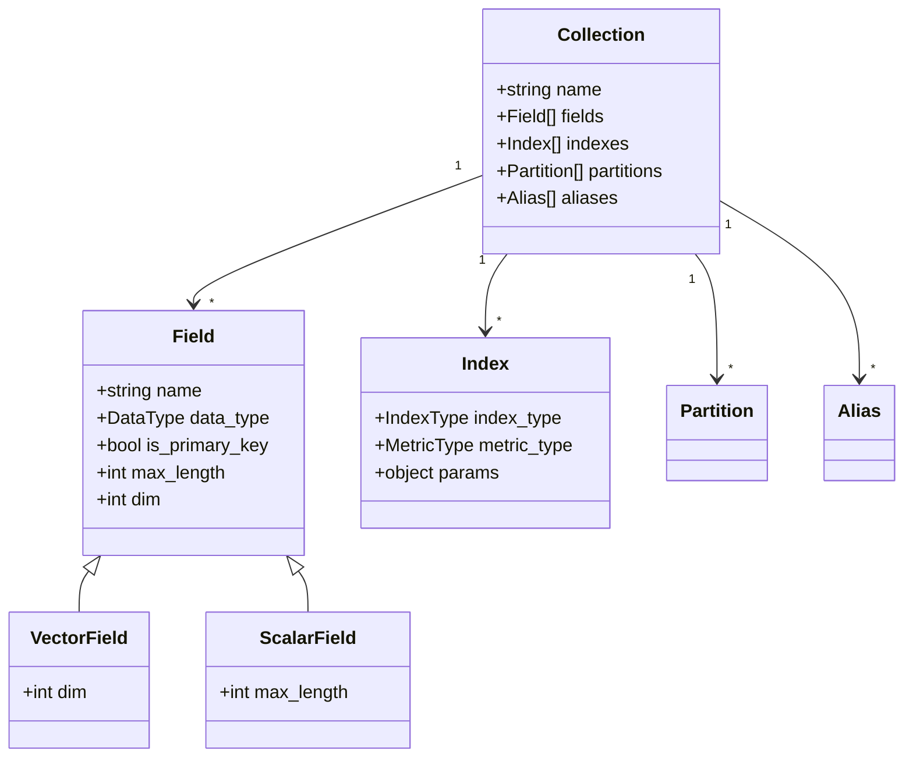

# Milvus 学习知识图谱

> 单一事实源：`./graph.json`。本文件（Mermaid 图谱 + 节点说明表）严格对齐 JSON；新增节点时请同步两边。

## 对应章节
- 锚点脚本：`src/insert.mjs`（建表 / 索引 / 灌库）+ `src/query.mjs`（向量检索）+ `src/rag.mjs`（RAG 检索增强生成闭环）+ `src/update.mjs`（upsert 实现“更新”）+ `src/delete.mjs`（三种姿势删除）+ `src/ebook-write.mjs`（EPUB 长文档 → 按章节 → 二次拆分 → 流式灌库）
- 范围：Milvus 完整 CRUD（C/R/U/D）+ 集合管理 + 索引 + 检索 + RAG 闭环 + 长文档预处理 + 系统管理
- 节点总数：44（step: 22 / concept: 18 / param: 4）
- 边总数：59

## 流程图（CRUD 全景）

```mermaid
flowchart TD
    %% ============ 概念层 ============
    subgraph CONCEPT["概念层"]
        collection["集合 Collection"]
        field["字段 Field"]
        schema["Schema"]
        pk["主键"]
        index["索引 Index"]
        metric["MetricType"]
        embedding["Embedding"]
        cFilterExpr["concept.filter_expr<br/>Filter 表达式"]
        partition["分区 Partition"]
        alias["别名 Alias"]
        dim["VECTOR_DIM"]
        nlist["IVF_FLAT.nlist"]
        chunkSize["CHUNK_SIZE"]
        chunkOverlap["CHUNK_OVERLAP"]
    end

    %% ============ RAG 概念 ============
    subgraph RAG_CONCEPT["RAG 概念"]
        cRag["concept.rag<br/>RAG"]
        cPrompt["concept.prompt<br/>Prompt"]
        cContext["concept.context<br/>Context"]
        cLlm["concept.llm<br/>LLM"]
    end

    %% ============ C: Create ============
    subgraph CREATE["C — Create"]
        sConnect["step.connect<br/>连接 Milvus"]
        sCreateCol["step.create_collection<br/>创建集合"]
        sCreateIdx["step.create_index<br/>创建索引"]
        sLoad["step.load_collection<br/>加载集合"]
        sInsert["step.insert<br/>插入数据"]
    end

    %% ============ R: Read ============
    subgraph READ["R — Read"]
        sQuery["step.query<br/>标量查询"]
        sSearch["step.search<br/>向量检索<br/><i>src/query.mjs</i>"]
        sHybrid["step.hybrid_search<br/>混合检索"]
        sGet["step.get<br/>按主键取"]
    end

    %% ============ U: Update ============
    subgraph UPDATE["U — Update"]
        sUpsert["step.upsert<br/>Upsert<br/><i>src/update.mjs</i>"]
    end

    %% ============ D: Delete ============
    subgraph DELETE["D — Delete"]
        sDelete["step.delete<br/>删除<br/><i>src/delete.mjs</i>"]
        sRelease["step.release_collection<br/>释放"]
        sDrop["step.drop_collection<br/>删除集合"]
    end

    %% ============ 辅助 ============
    subgraph AUX["辅助 / 管理"]
        sFlush["step.flush<br/>刷盘"]
        sCreatePart["step.create_partition<br/>创建分区"]
        sCreateAlias["step.create_alias<br/>创建别名"]
    end

    %% ============ RAG 闭环 ============
    subgraph RAG["RAG 闭环"]
        sRetrieve["step.retrieve<br/>检索<br/><i>src/rag.mjs</i>"]
        sAugment["step.augment<br/>增强<br/><i>src/rag.mjs</i>"]
        sGenerate["step.generate<br/>生成<br/><i>src/rag.mjs</i>"]
    end

    %% ============ 长文档预处理 ============
    subgraph LONG_DOC["长文档预处理（ebook-write.mjs）"]
        cEpubLoader["concept.epub_loader<br/>EPUB 加载器"]
        cTextSplitter["concept.text_splitter<br/>文本拆分器"]
        cChunk["concept.chunk<br/>Chunk 文本片段"]
        cStreaming["concept.streaming<br/>流式处理"]
        sLoadEpub["step.load_epub<br/>加载 EPUB<br/><i>src/ebook-write.mjs</i>"]
        sSplitText["step.split_text<br/>文本拆分<br/><i>src/ebook-write.mjs</i>"]
        sStreamingInsert["step.streaming_insert<br/>流式灌库<br/><i>src/ebook-write.mjs</i>"]
    end

    %% ---------- Create 链路 ----------
    sConnect -->|前置| sCreateCol
    sCreateCol -->|前置| sCreateIdx
    sCreateCol -->|前置| sLoad
    sCreateIdx -.->|无依赖| sLoad
    sLoad -.->|无依赖| sInsert

    %% ---------- Create 链路到 Read ----------
    sLoad -->|前置| sSearch
    sLoad -->|前置| sQuery
    sSearch -->|依赖| embedding
    sSearch -->|依赖| metric
    sSearch -->|对照| sQuery
    sSearch -->|后置| sGet
    sSearch -->|对照| sHybrid

    %% ---------- Update / Delete ----------
    sInsert -->|对照| sUpsert
    sSearch -->|依赖| cFilterExpr
    sDelete -->|依赖| cFilterExpr
    sDelete -->|无依赖| sFlush
    sRelease -->|对照| sLoad
    sRelease -->|前置| sDrop
    sCreateCol -->|前置| sCreateAlias
    sCreateCol -->|前置| sCreatePart

    %% ---------- 概念依赖 ----------
    collection -->|依赖| field
    collection -->|依赖| index
    collection -->|依赖| partition
    collection -->|依赖| alias
    field -->|依赖| schema
    field -->|依赖| pk
    field -->|依赖| embedding
    index -->|依赖| metric
    dim -->|依赖| embedding
    dim -->|依赖| field
    nlist -->|依赖| index
    nlist -->|依赖| metric

    %% ---------- Create 链路到 RAG ----------
    sSearch -->|依赖| sRetrieve
    embedding -->|依赖| sRetrieve
    sRetrieve -->|前置| sAugment
    sRetrieve -->|依赖| cContext
    cContext -->|依赖| sRetrieve
    sAugment -->|依赖| cPrompt
    cContext -->|依赖| cPrompt
    sAugment -->|前置| sGenerate
    sGenerate -->|依赖| cLlm
    cRag -->|依赖| sRetrieve
    cRag -->|依赖| sAugment
    cRag -->|依赖| sGenerate

    %% ---------- 长文档预处理链路 ----------
    sLoadEpub -->|前置| sSplitText
    sSplitText -->|前置| sStreamingInsert
    sStreamingInsert -->|依赖| embedding
    sStreamingInsert -->|依赖| sInsert
    sStreamingInsert -->|依赖| cStreaming
    sLoadEpub -->|依赖| cStreaming
    cStreaming -->|依赖| cChunk
    cChunk -->|依赖| cTextSplitter
    cChunk -->|依赖| embedding
    cEpubLoader -->|依赖| sLoadEpub
    cTextSplitter -->|依赖| sSplitText
    chunkSize -->|依赖| cTextSplitter
    chunkOverlap -->|依赖| cTextSplitter
    chunkSize -->|对照| chunkOverlap

    %% ---------- 样式 ----------
    classDef step fill:#dde9ff,stroke:#4a6fa5,color:#1a2b4a;
    classDef concept fill:#fff4d6,stroke:#a8923d,color:#5a4a1a;
    classDef param fill:#d6f0d6,stroke:#4a8c4a,color:#1a4a1a;
    classDef rag fill:#f7d6e8,stroke:#a83d7a,color:#5a1a3a;
    classDef longdoc fill:#d6e8f0,stroke:#4a7a8c,color:#1a3a4a;
    class sConnect,sCreateCol,sCreateIdx,sLoad,sInsert,sQuery,sSearch,sHybrid,sGet,sUpsert,sDelete,sRelease,sDrop,sFlush,sCreatePart,sCreateAlias,sRetrieve,sAugment,sGenerate,sLoadEpub,sSplitText,sStreamingInsert step;
    class collection,field,schema,pk,index,metric,embedding,cFilterExpr,partition,alias,cEpubLoader,cTextSplitter,cChunk,cStreaming concept;
    class dim,nlist,chunkSize,chunkOverlap param;
    class cRag,cPrompt,cContext,cLlm rag;
```

## 类图（集合与字段的组成）

## 节点说明表

| ID | 中文名 | 类别 | 简短说明 | 代码位置 |
|----|--------|------|----------|----------|
| concept.collection | 集合 | concept | 等价于 SQL 表；字段 + 索引 + 加载状态 | `src/insert.mjs:60-87` |
| concept.field | 字段 | concept | 集合的列；含 VarChar / FloatVector / Array 等 | `src/insert.mjs:67-73` |
| concept.schema | Schema | concept | 字段列表，决定一行形状 | `src/insert.mjs:67-73` |
| concept.primary_key | 主键 | concept | 唯一标识一行；Int64/VarChar | `src/insert.mjs:67` |
| concept.index | 索引 | concept | 向量字段的 ANN 索引（IVF_FLAT/HNSW/…） | `src/insert.mjs:93-99` |
| concept.metric | MetricType | concept | COSINE / L2 / IP；索引与检索必须一致 | `src/insert.mjs:97` |
| concept.embedding | Embedding | concept | 深度模型产出的定长浮点向量 | `src/update.mjs:21-23, 33-40, 52-55, 86-94` |
| concept.filter_expr | Filter 表达式 | concept | 跨字段过滤语法；query/delete/search 都用 | `src/delete.mjs:39-53, 59-74, 76-94` |
| concept.partition | 分区 | concept | 集合内子划分，按切片加速搜索 | — |
| concept.alias | 别名 | concept | 给集合起逻辑名，便于版本切换 | — |
| concept.rag | RAG | concept | Retrieve + Augment + Generate 三步闭环 | `src/rag.mjs:1-31` |
| concept.context | Context | concept | 检索结果拼出的结构化文本 | `src/rag.mjs:93-101` |
| concept.prompt | Prompt | concept | 角色 + context + 问题 + 约束 的模板 | `src/rag.mjs:104-118` |
| concept.llm | LLM | concept | ChatOpenAI 生成式模型 | `src/rag.mjs:9-16, 122` |
| param.vector_dim | VECTOR_DIM | param | 维度常量；schema.dim = embedding 维度 | `src/insert.mjs:31` |
| param.ivf_flat | IVF_FLAT.nlist | param | nlist：聚类中心数 ≈ √N | `src/insert.mjs:98` |
| step.connect | 连接 | step | `await client.connectPromise` | `src/insert.mjs:55-57` |
| step.create_collection | 创建集合 | step | `client.createCollection` | `src/insert.mjs:63-75` |
| step.create_index | 创建索引 | step | `client.createIndex` | `src/insert.mjs:92-100` |
| step.load_collection | 加载集合 | step | `client.loadCollection` | `src/insert.mjs:105-106` |
| step.insert | 插入数据 | step | `client.insert` | `src/insert.mjs:196-200` |
| step.upsert | Upsert | step | 按主键存在则覆盖；文本更新后必须重新 Embedding | `src/update.mjs:60-106` |
| step.query | 标量查询 | step | `client.query` + filter | — |
| step.search | 向量检索 | step | `client.search`，需集合已加载 + Embedding 已就绪 | `src/query.mjs:1-15, 21-24, 37-44, 47-54` |
| step.hybrid_search | 混合检索 | step | 多向量检索 + rerank | — |
| step.get | 按主键取 | step | search 返回 id 后回查 | — |
| step.delete | 删除数据 | step | 按主键 / filter；底层软删除 | `src/delete.mjs:39-94` |
| step.flush | 刷盘 | step | 内存 segment 落盘 | — |
| step.create_partition | 创建分区 | step | 切片写入/查询 | — |
| step.create_alias | 创建别名 | step | 给集合起逻辑名 | — |
| step.release_collection | 释放集合 | step | `client.releaseCollection` | — |
| step.drop_collection | 删除集合 | step | 不可恢复，慎用 | — |
| step.retrieve | 检索 | step | RAG 第一步：复用 client.search | `src/rag.mjs:44-63` |
| step.augment | 增强 | step | RAG 第二步：拼 context + 组 prompt | `src/rag.mjs:93-118` |
| step.generate | 生成 | step | RAG 第三步：`model.invoke` | `src/rag.mjs:120-126` |
| concept.epub_loader | EPUB 加载器 | concept | EPubLoader 按章节拆 EPUB；splitChapters:true | `src/ebook-write.mjs:213-221` |
| concept.text_splitter | 文本拆分器 | concept | RecursiveCharacterTextSplitter；递归分隔符层级 | `src/ebook-write.mjs:241-247` |
| concept.chunk | Chunk 文本片段 | concept | 拆分后最小单元 = Milvus 一行；含 book_id/chapter_num/index | `src/ebook-write.mjs:261-282` |
| concept.streaming | 流式处理 | concept | 边生成边插入，内存友好 + 失败可定位 | `src/ebook-write.mjs:208, 251-280` |
| param.chunk_size | CHUNK_SIZE | param | 单 chunk 目标字符数（500） | `src/ebook-write.mjs:39` |
| param.chunk_overlap | CHUNK_OVERLAP | param | 相邻 chunk 重叠字符数（50） | `src/ebook-write.mjs:246` |
| step.load_epub | 加载 EPUB | step | `new EPubLoader(file, { splitChapters: true })` | `src/ebook-write.mjs:211-223` |
| step.split_text | 文本拆分 | step | `textSplitter.splitText(chapter)` | `src/ebook-write.mjs:241-275` |
| step.streaming_insert | 流式灬库 | step | 逐章循环：拆 → embed → insert | `src/ebook-write.mjs:249-282` |

## 边（关系）一览

| 起点 | 关系 | 终点 | 备注 |
|------|------|------|------|
| step.connect | 前置 | step.create_collection | 必须先连接才能建集合 |
| step.create_index | 无依赖 | step.load_collection | 索引与加载互不阻塞，但通常一起做 |
| step.load_collection | 无依赖 | step.insert | 插入不需要加载，但脚本顺序中排在加载之后 |
| step.create_collection | 前置 | step.create_index | 字段定义存在后才能建索引 |
| step.create_collection | 前置 | step.load_collection | 集合存在才能加载 |
| step.search | 前置 | step.load_collection | 集合已加载才能 search |
| step.search | 依赖 | concept.embedding | search 前需把文本 Embedding 成向量 |
| step.search | 依赖 | concept.metric | 检索 metric_type 须与索引一致 |
| step.search | 对照 | step.query | 文件命名差异：query.mjs 实际是 search；SDK 中 search=ANN, query=标量过滤 |
| step.query | 依赖 | concept.filter_expr | query 的入参也是 filter 表达式 |
| step.delete | 依赖 | concept.filter_expr | delete 的入参是 filter 表达式 |
| step.delete | 无依赖 | step.flush | 删除后通常 flush 让刷盘更彻底 |
| step.query | 前置 | step.load_collection | 集合已加载才能 query |
| step.search | 后置 | step.get | search 拿 id，get 拉完整记录 |
| step.search | 对照 | step.hybrid_search | hybrid 是多个 search + rerank |
| step.insert | 对照 | step.upsert | upsert = insert + 主键覆盖 |
| step.upsert | 依赖 | concept.embedding | 更新文本后必须重新 Embedding，否则向量与新文本失配 |
| step.release_collection | 对照 | step.load_collection | 释放/加载是一对反向操作 |
| step.drop_collection | 前置 | step.release_collection | 删除前建议先释放 |
| step.create_partition | 前置 | step.insert | 建好分区才能写入时指定 |
| step.create_alias | 前置 | step.create_collection | 别名指向已存在集合 |
| concept.collection | 依赖 | concept.field | 集合由字段组成 |
| concept.collection | 依赖 | concept.index | 集合可挂载索引 |
| concept.collection | 依赖 | concept.partition | 分区属于集合 |
| concept.collection | 依赖 | concept.alias | 别名指向集合 |
| concept.field | 依赖 | concept.schema | schema = 字段列表 |
| concept.field | 依赖 | concept.primary_key | 主键是特殊字段 |
| concept.field | 依赖 | concept.embedding | 向量字段承载 Embedding |
| concept.index | 依赖 | concept.metric | 索引必须指定度量 |
| param.vector_dim | 依赖 | concept.embedding | Embedding 维度 = VECTOR_DIM |
| param.vector_dim | 依赖 | concept.field | FloatVector.dim = VECTOR_DIM |
| param.ivf_flat | 依赖 | concept.index | nlist 是 IVF_FLAT 参数 |
| param.ivf_flat | 依赖 | concept.metric | IVF_FLAT 配合 COSINE/L2 |
| step.retrieve | 依赖 | step.search | RAG 检索复用 client.search |
| step.retrieve | 依赖 | concept.embedding | 检索前需 Embedding 问题 |
| step.augment | 前置 | step.retrieve | 必须先有检索结果才能拼 context |
| step.augment | 依赖 | concept.context | context 是 augment 的产物 |
| step.augment | 依赖 | concept.prompt | prompt 是 augment 的输出 |
| step.generate | 前置 | step.augment | LLM 需要 prompt |
| step.generate | 依赖 | concept.llm | generate 调用 LLM |
| concept.rag | 依赖 | step.retrieve | R = Retrieve |
| concept.rag | 依赖 | step.augment | A = Augment |
| concept.rag | 依赖 | step.generate | G = Generate |
| concept.context | 依赖 | step.retrieve | context 由检索结果组装 |
| concept.prompt | 依赖 | concept.context | prompt 内嵌 context |

## 维护说明
详见 [`README.md`](./README.md)。修改任何节点 / 边时请先改 `graph.json`，再同步本文件中的 Mermaid 块与说明表。